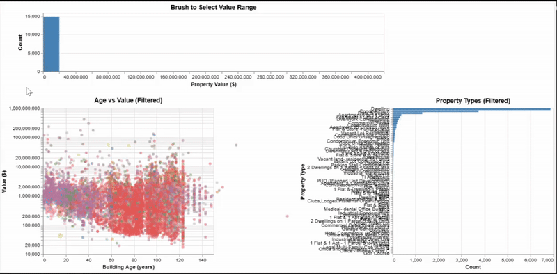
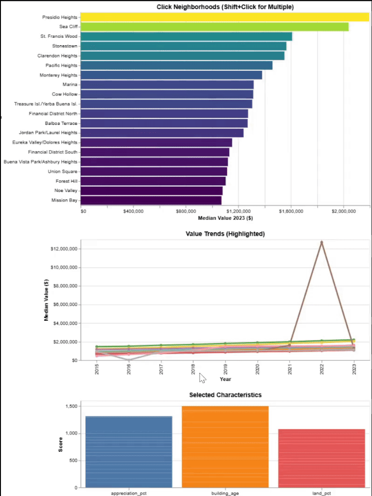
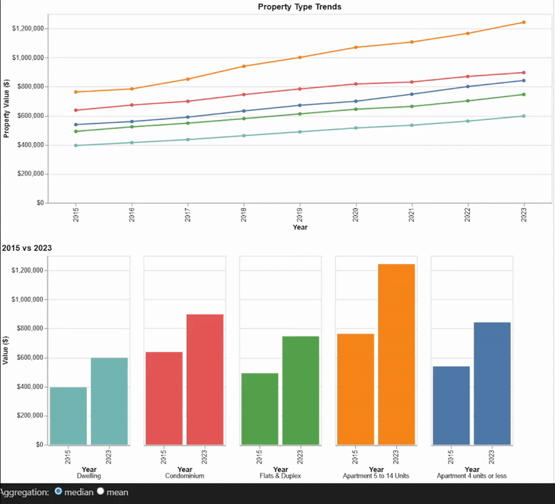
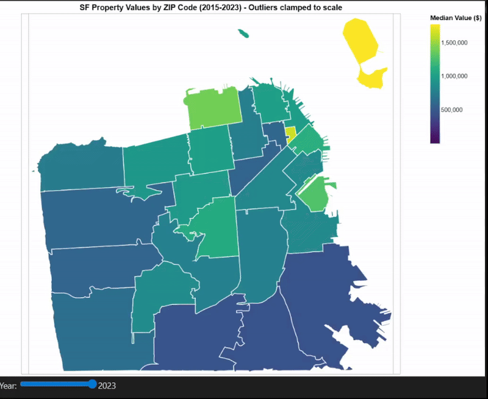

# San Francisco Property Tax Analysis & Gentrification Risk Assessment

[](https://www.python.org/downloads/)
[](https://jupyter.org/)
[](https://developer.mozilla.org/en-US/docs/Web/JavaScript)

> **Academic Project** | CS 424 – Visualization & Visual Analytics | University of Illinois Chicago | Fall 2025

**Author:** Anand Meena (ameen4@uic.edu)  

---

## Project Overview

This project implements interactive data visualizations to analyze San Francisco property tax data (2015-2023) using Vega-Lite, Altair, and custom web technologies. The analysis explores property value distributions, neighborhood trends, gentrification patterns, and spatial correlations through multiple interactive interfaces.

### Key Features

- **Linked Visualizations**: 4 coordinated views with brush, click, and radio button interactions
- **Spatial Analysis**: Choropleth maps with ZIP code-level property value distribution
- **Interactive Dashboard**: 6+ linked views combining spatial and temporal analysis
- **Web Application**: Standalone HTML/JavaScript dashboard for browser-based exploration
- **Gentrification Insights**: Identification of appreciation patterns and gentrification frontiers
- **Performance Optimized**: Handles 1.5M+ property records with responsive interactions

### Dataset

**Source:** [San Francisco Open Data Portal - Assessor Historical Secured Property Tax Rolls](https://data.sfgov.org/Housing-and-Buildings/Assessor-Historical-Secured-Property-Tax-Rolls/wv5m-vpq2)

**Coverage:** 2015-2023 (9 years)  
**Records:** ~1.5 million property assessments  
**Geographic Scope:** All San Francisco ZIP codes

---

## Quick Start

### 1. Clone Repository

```bash
git clone https://github.com/YOUR_USERNAME/sf-property-tax-analysis.git
cd sf-property-tax-analysis
```

### 2. Install Dependencies

```bash
# Create virtual environment (recommended)
python -m venv venv
source venv/bin/activate  # On Windows: venv\Scripts\activate

# Install requirements
pip install -r requirements.txt
```

### 3. Download Data Files

**Large data files available on Google Drive:**  
[Download Data Files](https://drive.google.com/drive/folders/1U8oAurTYB6y-9U_dCPxy2DU8UZgknGHq?usp=sharing)

Required file:
- `sf_property_data_clean.parquet` (212 MB)

Place in `data/` directory.

**Note:** The small GeoJSON file (`San_Francisco_ZIP_Codes_20251020.geojson`) is already included in the repo.

### 4. Run Jupyter Notebooks

```bash
jupyter notebook
```

Navigate to `notebooks/` folder and open any notebook:
- `linked_views.ipynb` - Linked visualizations with interaction patterns
- `spatial_visualization.ipynb` - Choropleth maps and spatial analysis
- `data_visualization.ipynb` - Static analysis and exploratory visualizations
- `interactive_visualizations.ipynb` - Additional interactive components
- `data_importing_transformation.ipynb` - Data preprocessing pipeline
- `embeddings_projections.ipynb` - Dimensionality reduction analysis

### 5. View Web Application

Open `webapp/Index.html` in a web browser to access the interactive dashboard.

**Features:**
- Real-time data filtering
- Interactive choropleth maps
- Temporal controls and animations
- Responsive design
- No server required (runs entirely in browser)

---

## Project Structure

```
sf-property-tax-analysis/
├── data/
│   ├── San_Francisco_ZIP_Codes_20251020.geojson  # Included (673 KB)
│   └── sf_property_data_clean.parquet            # Download separately (212 MB)
├── notebooks/
│   ├── linked_views.ipynb
│   ├── spatial_visualization.ipynb
│   ├── data_visualization.ipynb
│   ├── interactive_visualizations.ipynb
│   ├── data_importing_transformation.ipynb
│   └── embeddings_projections.ipynb
├── images/
│   ├── value_distribution_with_linked_scatter_and_bar_charts.gif
│   ├── neighborhood_bar_chart_with_linked_time_series.gif
│   ├── age_vs_value_scatter_with_density_heatmap.gif
│   ├── property_type_trends_with_year_comparison.gif
│   ├── Linked_spatial_dashboard.gif
│   ├── ZIP_choropleth_with_year_slider_2015-2023.gif
│   └── [40+ additional visualizations]
├── webapp/
│   ├── Index.html        # Main web application
│   ├── script.js         # Interactive functionality
│   └── style.css         # Styling and layout
├── .gitignore
├── requirements.txt
└── README.md
```

---

## Notebooks Overview

### 1. Linked Views (`linked_views.ipynb`)

Four coordinated views exploring property relationships through different interaction mechanisms.

**View 1: Property Value Distribution Explorer**



- **Interactions:** Brush selection on histogram filters scatter plot and bar chart
- **Questions Answered:** Value distribution patterns, age-value relationships, property type dominance

**View 2: Neighborhood Comparison Dashboard**



- **Interactions:** Click selection with multi-select (Shift+click)
- **Questions Answered:** Highest-value neighborhoods, temporal evolution, distinguishing characteristics

**View 3: Building Age and Value Explorer**


- **Interactions:** Pan and zoom with linked density heatmap
- **Questions Answered:** Age-value correlation, density distribution, land value variation

**View 4: Property Type Value Trends**



- **Interactions:** Radio button toggles median/mean aggregation
- **Questions Answered:** Property type evolution, 2015 vs 2023 comparison, aggregation method impact

---

### 2. Spatial Visualization (`spatial_visualization.ipynb`)

Choropleth maps with temporal controls for geographic analysis.



**Key Features:**
- Year slider for temporal navigation
- Click selection on ZIP codes
- Color-coded value distributions
- Interactive tooltips with property statistics

**Maps Include:**
- Median property value by ZIP code
- Year-over-year appreciation rates
- Building age distribution
- Land value percentage

---

### 3. Integrated Dashboard (`interactive_visualizations.ipynb`)

Six linked views combining spatial and temporal analysis.


**Dashboard Components:**

**Row 1:**
- Choropleth Map: Geographic distribution with year filter
- Time Series: Median value trends for selected ZIPs
- Above/Below Median: Comparison chart

**Row 2:**
- Rank Bars: Top 15 ZIPs by median value
- Deviation Heatmap: ZIP performance vs city median

**Row 3:**
- Age Histogram: Building age distribution
- Age vs Value Scatter: Relationship analysis

---

### 4. Data Visualization (`data_visualization.ipynb`)

Comprehensive exploratory data analysis with 15+ static visualizations:

- Property tax records by year
- Property value distribution analysis
- Ridge plots showing value shifts over time
- Land vs improvement value comparisons
- Building age and bedroom count distributions
- Top property types analysis
- COVID-era comparison (pre vs during pandemic)
- Neighborhood recovery slopes
- Gentrification risk assessment
- Parallel coordinates plots

---

### 5. Data Pipeline (`data_importing_transformation.ipynb`)

Complete data preprocessing workflow:

- Data ingestion from SF Open Data API
- Cleaning and validation
- Feature engineering (building age, land percentage, appreciation rates)
- Geospatial data integration
- Export to optimized formats (Parquet, GeoJSON)

---

### 6. Embeddings & Projections (`embeddings_projections.ipynb`)

Advanced dimensionality reduction analysis:

- Property feature embedding generation
- t-SNE and UMAP projections
- Cluster identification
- Interactive 2D scatter plots
- Pattern discovery in high-dimensional property data

---

## Web Application

### Features

**Interactive Dashboard:**
- Real-time filtering by year, neighborhood, property type
- Coordinated highlighting across multiple views
- Responsive design (desktop and tablet)
- No installation required (runs in browser)

**Visualizations:**
- Choropleth maps with year slider
- Time series charts
- Distribution histograms
- Scatter plots with pan/zoom

**Technical Details:**
- Pure JavaScript (ES6)
- D3.js for data-driven visualizations
- CSS Grid for responsive layout
- Client-side data processing

### Usage

```bash
# Option 1: Open directly in browser
open webapp/Index.html

# Option 2: Serve with local HTTP server (recommended)
cd webapp
python -m http.server 8000
# Then open http://localhost:8000 in browser
```

---

## Key Findings

### 1. The Pacific Heights "Historic Luxury" Pattern

Historic properties (1920s-1940s) in northwest Pacific Heights appreciated **35% faster** than the neighborhood median from 2015-2023, creating a premium for architectural heritage. This pattern was nearly invisible in 2015 but became pronounced by 2023.

**Discovery Method:** Linked views - click Pacific Heights on choropleth, brush old buildings in scatter plot, observe time series acceleration.

### 2. COVID Impact Differentiation

Newer buildings (< 20 years old) experienced deeper value drops during COVID-19 (2020) but recovered faster (2021-2022) compared to historic single-family homes.

**Discovery Method:** Year slider analysis - move from 2019 → 2020 → 2022, observe scatter plot age segments respond differently.

### 3. Gentrification Frontiers Identified

Mid-century housing stock (50-80 years old, $800K-$1.2M) in eastern neighborhoods (Mission, Bayview) showed the fastest appreciation rates, indicating active gentrification zones.

**Discovery Method:** Deviation heatmap - brush positive deviation ranges, map highlights eastern ZIPs, time series shows post-2019 acceleration.

### 4. Land Scarcity Premium

Downtown and northern neighborhoods show land value growing significantly faster than improvement values, driven by geographic constraints and zoning.

**Discovery Method:** Color scatter plot by land percentage, observe downtown clusters have higher land ratios and steeper appreciation.

---

## Technologies Used

### Python Libraries

- **Altair** - Declarative statistical visualization grammar
- **Vega-Lite** - Interactive graphics specification
- **Pandas** - Data manipulation and analysis
- **GeoPandas** - Geospatial data operations
- **NumPy** - Numerical computing
- **Matplotlib** - Static plotting
- **Seaborn** - Statistical data visualization

### Web Technologies

- **HTML5** - Semantic markup and structure
- **CSS3** - Styling, Grid layout, Flexbox
- **JavaScript (ES6)** - Interactive functionality
- **D3.js** - Data-driven document manipulation (if used)
- **TopoJSON** - Efficient geographic data encoding

### Data Formats

- **Parquet** - Columnar storage for efficient data access
- **GeoJSON** - Geographic feature encoding
- **JSON** - Data interchange and configuration

---

## Performance Metrics

**Data Volume:**
- 1.5M+ property records
- 9 years temporal coverage
- 50+ ZIP codes
- 20+ property type categories

**Interaction Response:**
- Brush selection: < 100ms
- Click selection: < 50ms
- Year slider: < 200ms
- Pan/zoom: 60 FPS

**File Sizes:**
- Parquet data: 212 MB (compressed from 972 MB CSV)
- GeoJSON boundaries: 673 KB
- Web app: < 100 KB total
- Images: ~100 MB (GIFs and PNGs)

---

## Design Principles

### Interaction Mechanisms

**Data Manipulation:**
- **Brush selection**: Filters continuous value ranges (histograms, scatter plots)
- **Click selection**: Selects discrete categories (neighborhoods, ZIPs, property types)
- **Multi-select**: Shift+click for comparing multiple items

**View Manipulation:**
- **Pan and zoom**: Explore dense data regions (scatter plots)
- **Year slider**: Temporal navigation and animation
- **Radio buttons**: Toggle aggregation methods (median vs mean)

**Visual Mapping:**
- **Conditional encoding**: Highlight selections vs context
- **Synchronized updates**: All views update together
- **Consistent color schemes**: Viridis for continuous, Tableau10 for categorical

### Overplotting Solutions

- **Log scales** for right-skewed distributions
- **Opacity adjustments** (0.3-0.5 for scatter plots)
- **Heatmap aggregation** for dense regions
- **Top-N filtering** for categorical data (limit to 5-20 categories)
- **Sampling** for web performance (30K of 1.5M records in scatter plots)

### Coordination Strategy

- Shared parameters across all views (year, ZIP selection)
- Context preservation (unselected data shown in gray, not hidden)
- Visual feedback for selection propagation
- Persistent selection state across filter changes

---

## Usage Examples

### Example 1: Finding High-Appreciation Neighborhoods

1. Open `interactive_visualizations.ipynb` or web app
2. Move year slider from 2015 → 2023
3. Observe choropleth map color changes (darkening = appreciation)
4. Click on darkest ZIPs (Pacific Heights, Marina, Presidio)
5. Time series shows 40-50% appreciation over period
6. Age scatter reveals old buildings drove growth

### Example 2: Identifying Gentrification Risk Zones

1. Open deviation heatmap view
2. Brush positive deviation range (+20% to +50% above city median)
3. Map highlights outperforming ZIPs in eastern neighborhoods
4. Time series shows acceleration starting 2019
5. Age histogram reveals mid-century housing stock
6. **Insight:** Eastern SF experiencing rapid gentrification

### Example 3: COVID-19 Impact Analysis

1. Move year slider to 2020
2. Observe value drops in time series (all ZIPs affected)
3. Click affected ZIPs (SoMa, Mission Bay - newer developments)
4. Age scatter shows newer buildings (<20 years) dropped more
5. Move slider to 2021-2022 to observe recovery patterns
6. **Insight:** Modern condos more volatile than historic homes

### Example 4: Land Value Premium Discovery

1. Color scatter plot by land value percentage
2. Notice downtown ZIPs (via map click) have higher land percentages
3. Brush scatter plot high-land-percentage region
4. Map confirms clustering in downtown and northern neighborhoods
5. Time series shows land premium grew faster than building values
6. **Insight:** Geography constrains supply, driving land premiums

---

## Data Preprocessing

### Source Data Cleaning

```python
# Key preprocessing steps performed in data_importing_transformation.ipynb

1. Filter to residential properties only
2. Remove records with missing/invalid values
3. Standardize property types (consolidate 200+ types → 20 major categories)
4. Calculate derived metrics:
   - Building age: current_year - year_built
   - Land value percentage: (land_value / total_value) × 100
   - Year-over-year appreciation: (current_value / prior_value - 1) × 100
   - Deviation from city median: (zip_value / city_median - 1) × 100
5. Aggregate to ZIP-year level for choropleth maps
6. Sample strategically for scatter plots (30K records for performance)
7. Export to Parquet (5x compression vs CSV)
```

### Derived Metrics

- **Building Age**: 2023 - year_built
- **Land Value %**: (land_assessed_value / closed_roll_total_assessed_value) × 100
- **YoY Appreciation**: ((value_2023 / value_2022) - 1) × 100
- **Deviation from Median**: ((zip_median / city_median) - 1) × 100
- **Value Tier**: Quartile-based categorization (Low/Mid/High/Luxury)

---

## Known Limitations

1. **Data Coverage**: Limited to properties with complete tax records (excludes some newer developments)
2. **Sampling**: Scatter plots show 30K of 1.5M records for performance (representative sample)
3. **Geographic Resolution**: ZIP code level analysis (not parcel-level granularity)
4. **Temporal Granularity**: Annual snapshots only (no intra-year trends)
5. **Property Types**: Simplified to top 20 categories for clarity
6. **Web App**: Requires modern browser with JavaScript enabled
7. **Large Files**: Main dataset (212 MB) must be downloaded separately

---

## Dependencies

```txt
# Python
pandas>=1.3.0
altair>=4.2.0
geopandas>=0.10.0
numpy>=1.21.0
jupyter>=1.0.0
matplotlib>=3.5.0
seaborn>=0.11.0

# Web (included via CDN, no installation needed)
# - D3.js (if used)
# - Leaflet.js (if used for maps)
```

---

## Related Work

- [SF Open Data Portal](https://datasf.org/) - Source of property tax data
- [Vega-Lite Documentation](https://vega.github.io/vega-lite/) - Visualization grammar
- [Altair Gallery](https://altair-viz.github.io/gallery/) - Python visualization examples
- [GeoPandas Documentation](https://geopandas.org/) - Geospatial data handling
- [D3.js Gallery](https://observablehq.com/@d3/gallery) - Interactive visualization examples
